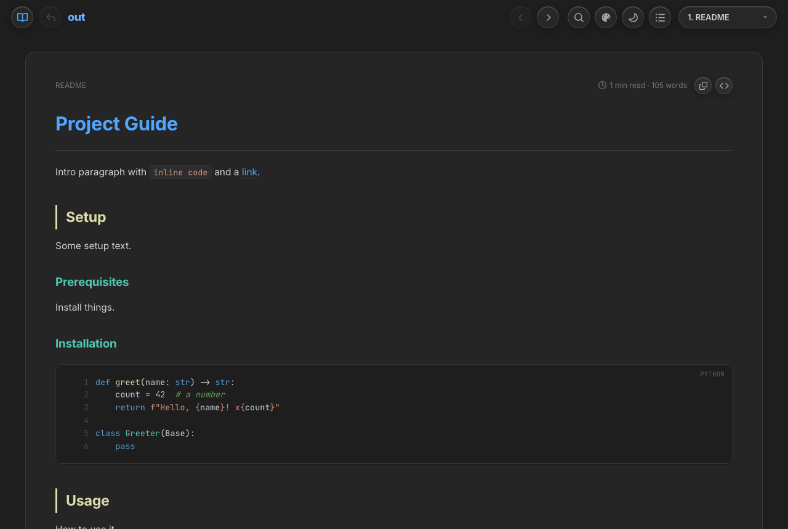
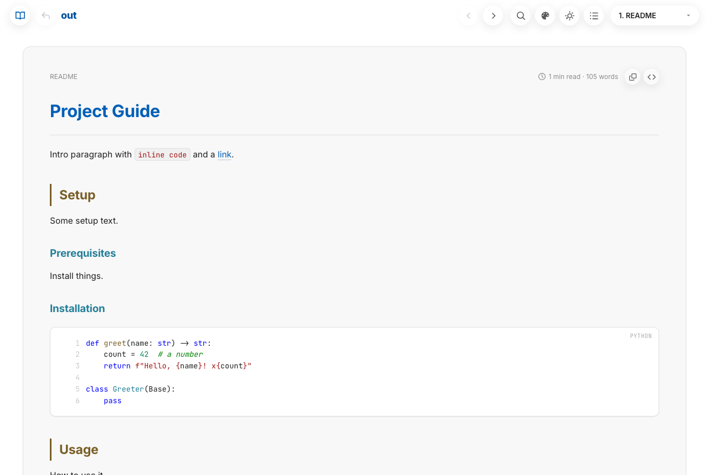
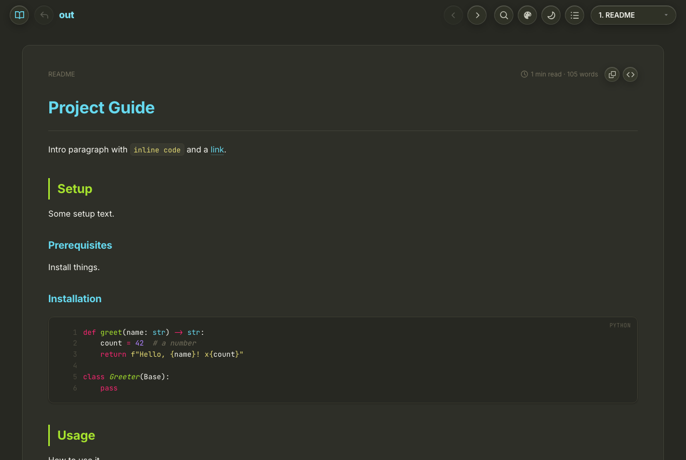
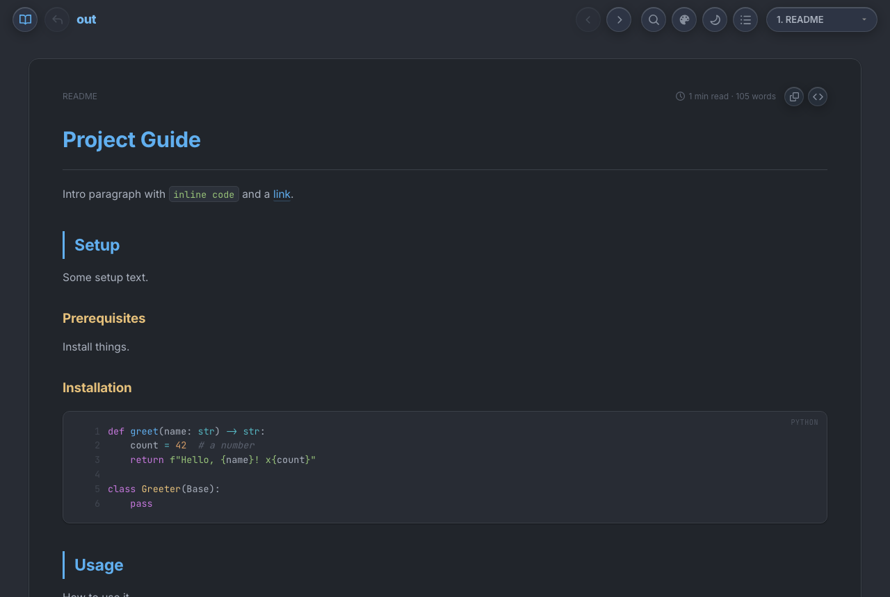
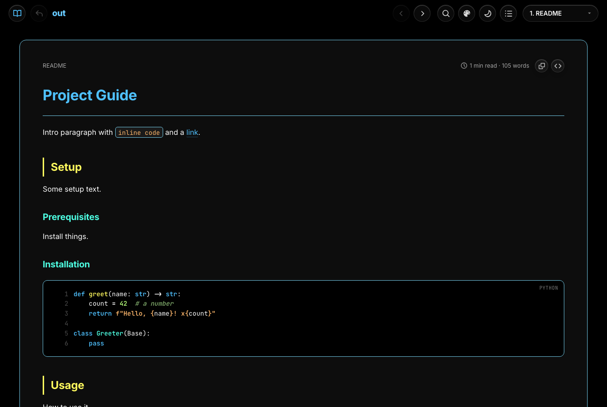
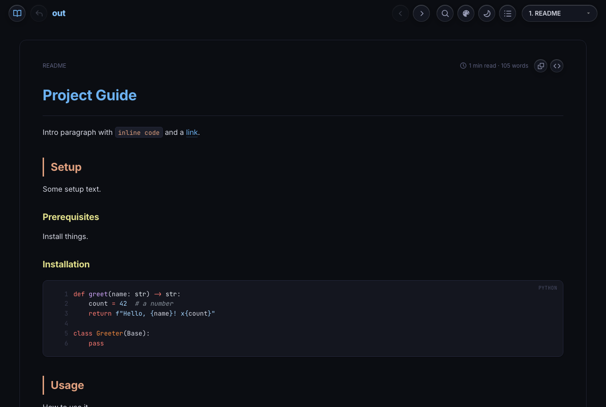
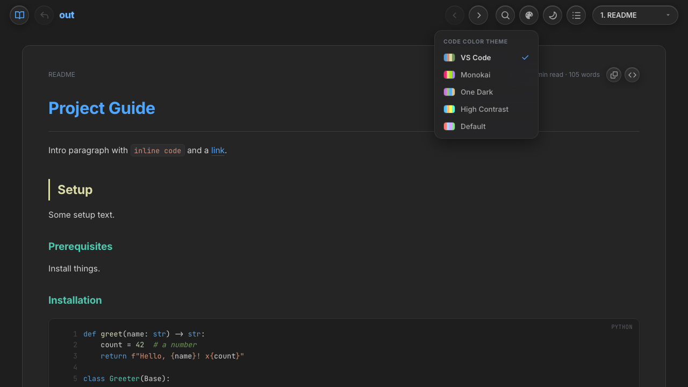

# htmler

> Turn a folder of Markdown, source code, and Jupyter notebooks into a single, self-contained, beautifully styled HTML page.

[](LICENSE)
[](htmler.sh)
[](https://www.python.org/)
[](#quick-start)

`htmler` is a single Bash script that walks a directory, converts every Markdown / code / notebook file it finds, and stitches them together into **one portable HTML file** with tabbed navigation, full-text search, a table of contents, syntax highlighting, and a light/dark theme. No build step, no servers, no dependencies to install by hand — just run it and open the result in any browser.

---

## Quick start

### No Download
```bash
# Run it directly from the web
wget -qO- https://raw.githubusercontent.com/nageshnnazare/htmler/refs/heads/main/htmler.sh | bash -s -- -o index.html
```

### Downloaded local copy
```bash
# Make it executable once
chmod +x htmler.sh

# From inside any docs folder: discover and convert everything
./htmler.sh

# Open the result
open combine_docs.html        # macOS
xdg-open combine_docs.html    # Linux
```

That's it. By default `htmler` recursively finds every supported file under the current directory and writes `combine_docs.html`.

## Themes

Every generated page ships with **five color themes**, each with a **light and a dark** variant. Pick one from the palette button in the navbar and the page re-skins instantly, and your choice is remembered across visits. The light/dark toggle and the theme picker compose, so any theme works in either mode.

The default theme is **VS Code**.

<table>
  <tr>
    <td width="50%" valign="top">
      <b>VS Code</b> (default) — Dark+ colors on the classic editor gray.<br>
      
    </td>
    <td width="50%" valign="top">
      <b>VS Code — Light+</b><br>
      
    </td>
  </tr>
  <tr>
    <td width="50%" valign="top">
      <b>Monokai</b> — the iconic pink/green/cyan on olive.<br>
      
    </td>
    <td width="50%" valign="top">
      <b>One Dark</b> — Atom's calm, muted palette.<br>
      
    </td>
  </tr>
  <tr>
    <td width="50%" valign="top">
      <b>High Contrast</b> — pure black, bold tokens, cyan rules.<br>
      
    </td>
    <td width="50%" valign="top">
      <b>Default</b> — htmler's original look (GitHub-style code).<br>
      
    </td>
  </tr>
</table>

Open the picker from the navbar to switch — the active theme is checkmarked and each shows a color swatch:



## Installation

`htmler` is a standalone script — clone the repo (or just copy `htmler.sh`) and put it somewhere on your `PATH`:

```bash
git clone https://github.com/nageshnnazare/htmler.git
cd htmler
chmod +x htmler.sh

# Optional: make it available everywhere
ln -s "$(pwd)/htmler.sh" ~/bin/htmler.sh
```

### Requirements

| Requirement | Notes |
|-------------|-------|
| Bash        | Ships with macOS and Linux. |
| Python ≥ 3.6 | Auto-detected; override with `PYTHON_BIN=/path/to/python3`. |
| `markdown`  | Installed automatically (`pip install --user`) if absent. |
| `Pygments`  | Powers build-time syntax highlighting; installed automatically if absent. |

An internet connection is only needed the first time, to fetch web fonts from a CDN (and to install `markdown`/`Pygments` if missing). Syntax highlighting itself is baked into the page at build time, so the colors work fully offline.

## Usage

```text
htmler.sh [-o output.html] [-x dir ...] [-f file ...] [file ...]

  -o output.html   Name of the generated HTML (default: combine_docs.html)
  -f file          Include a specific file (repeatable). May also be passed as
                   positional arguments or as a glob. When any files are given,
                   ONLY those files are included, in the order provided.
  -x dir           Exclude a directory from recursive discovery (repeatable).
                   Matches a bare directory name (e.g. figures) anywhere in the
                   tree, or a path relative to the current directory
                   (e.g. docs/figures). Ignored when explicit files are given.
  -h               Show usage.

  (no files)       Default: recursively discover every supported file under the
                   current directory, with README pinned to the top.
```

### Examples

```bash
# Convert everything under the current directory (default)
./htmler.sh

# Custom output name
./htmler.sh -o guide.html

# Discover everything, but skip some directories
./htmler.sh -x figures -x build
./htmler.sh -x docs/figures        # exclude a specific path

# A hand-picked, ordered set of files
./htmler.sh -o guide.html -f README.md -f docs/intro.md -f docs/api.md

# A list after a single -f
./htmler.sh -f README.md HOWTO.md CHANGELOG.md

# Globs (expanded by your shell, or quoted and expanded by htmler)
./htmler.sh -o api.html -f 'docs/*.md'
./htmler.sh -o all.html -f 'docs/**/*.md'

# Mix Markdown with source files and notebooks
./htmler.sh -o project.html -f README.md -f src/main.cpp -f notebooks/demo.ipynb
```

### Supported file types

| Type | Extensions |
|------|-----------|
| Markdown  | `.md` |
| C / C++   | `.c`, `.cc`, `.cxx`, `.c++`, `.cpp`, `.h`, `.hpp` |
| CUDA      | `.cu` |
| Python    | `.py` |
| Jupyter   | `.ipynb` |

Source files are wrapped in fenced code blocks with the right language for highlighting; notebooks have their Markdown and code cells rendered in order.

## Keyboard shortcuts

| Shortcut | Action |
|----------|--------|
| `Ctrl/⌘ + K` | Open full-text search |
| `Ctrl/⌘ + B` | Toggle the documents sidebar |
| `Ctrl/⌘ + I` | Toggle the on-this-page table of contents |
| `Ctrl/⌘ + Shift + L` | Switch light / dark theme |
| `g<number>` | Go to tab number |
| `gn` | Go to next tab |
| `gp` | Go to previous tab |


## License

[MIT](LICENSE) © Nagesh Nazare
